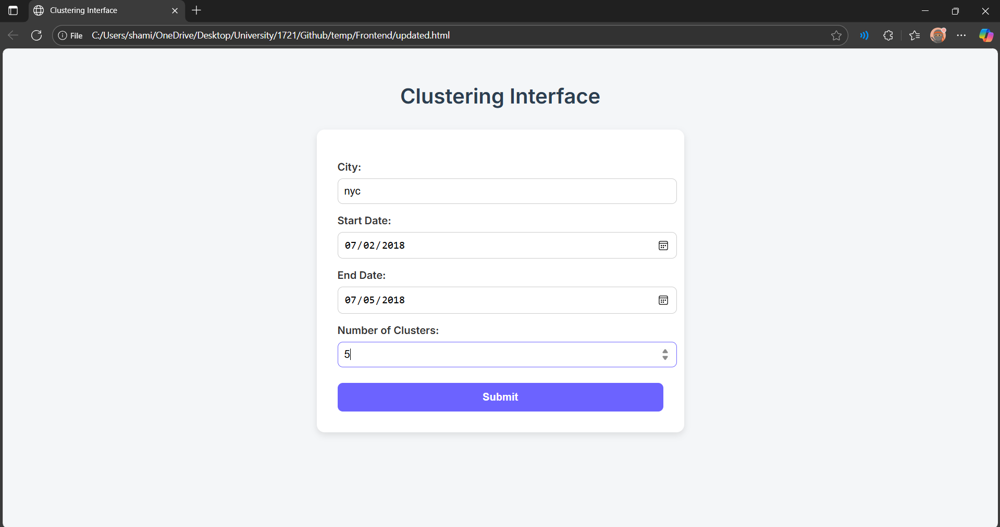
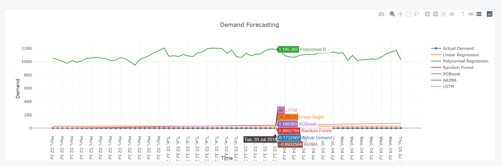
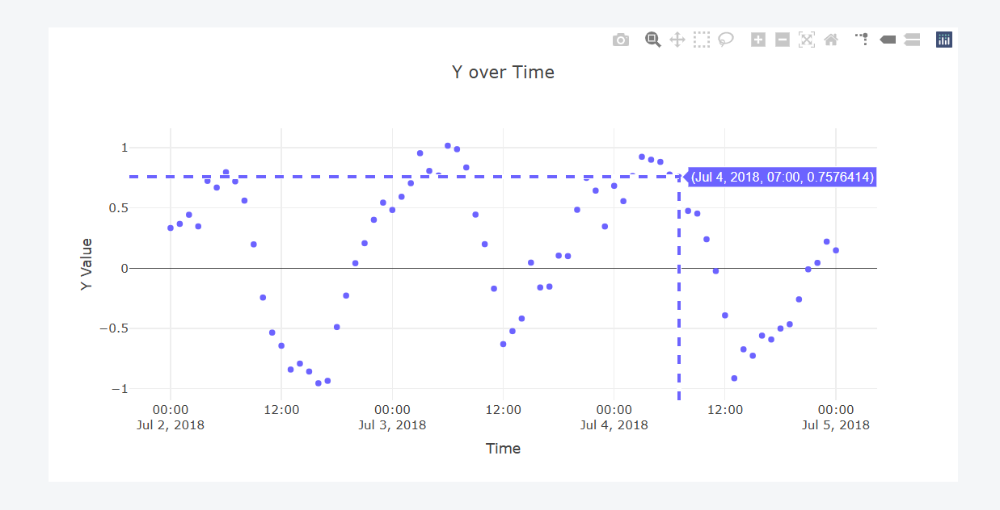
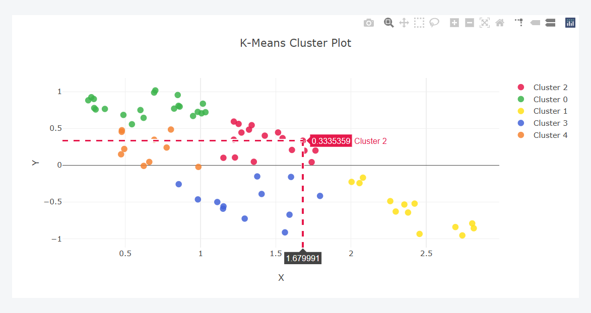

# Electricity Demand Forecasting & Clustering Platform

## Project Overview

This project analyzes hourly electricity demand and weather data for ten major U.S. cities. It provides:

1. **Cluster Analysis:** Identification of groups with similar consumption–weather patterns across cities and time periods.
2. **Predictive Modeling:** Machine learning models to forecast future electricity demand.
3. **Front-End Interface:** A user-friendly web interface for data input, model controls, and visualization of clustering and forecasting results.

## Repository Structure

```
Model_Training.ipynb        # Jupyter notebook for data cleaning, feature engineering, clustering, and model training
Backend/
    app.py                  # Flask API serving clustering and forecasting endpoints
Dataset/
    data.csv                # Raw dataset (hourly demand and weather)
Frontend/
    index.html            # Web interface for visualizations

```

## How It Works

### 1. Data Preparation & Model Training

- Use [`Model_Training.ipynb`](Model_Training.ipynb) for:
  - Data cleaning and merging demand/weather data.
  - Feature engineering (e.g., lag features, PCA).
  - Clustering (K-Means, DBSCAN, Hierarchical).
  - Training regression models (Linear, Polynomial, Random Forest, XGBoost, LSTM, ARIMA).
  - Saving trained models to the `Backend/` directory.

### 2. Backend API

- [`Backend/app.py`](Backend/app.py) exposes endpoints:
  - `/clustering`: Returns cluster assignments for selected city/date range using K-Means on PCA-reduced data ([`clustering_data.csv`](Backend/clustering_data.csv)).
  - `/line`: Returns demand forecasts for selected city/date range using multiple models.
- Models are loaded from `.pkl` and `.h5` files in `Backend/`.

### 3. Front-End Visualization

- [`Frontend/index.html`](Frontend/index.html) provides:
  - Form inputs for city, date range, and number of clusters.
  - Interactive cluster plots and demand forecast plots using Plotly.
  - Calls backend endpoints via Axios.

### 4. Example Screenshots






## Getting Started

### Prerequisites

- Python 3.12+
- Node.js (for frontend development, optional)
- Required Python packages: `flask`, `pandas`, `scikit-learn`, `joblib`, `tensorflow`, `plotly`, `axios`

### Setup

1. **Install Python dependencies:**
   ```sh
   pip install flask pandas scikit-learn joblib tensorflow plotly
   ```

*Note:* Download all models and copy them to Backend folder: [LINK](https://drive.google.com/drive/folders/1O0RznKeRaHRuAIU0cNqbNitNg5Y8x272?usp=sharing)

2. **Run the backend server:**
   ```sh
   cd Backend
   python app.py
   ```

3. **Open the frontend:**
   - Open [`Frontend/index.html`](Frontend/index.html) in your browser.

### Usage

- Select a city, date range, and number of clusters in the web interface.
- View clustering results and demand forecasts for the selected parameters.

## Notebooks & Model Training

- All data processing, feature engineering, clustering, and model training steps are documented in [`Model_Training.ipynb`](Model_Training.ipynb).
- Models are saved to the `Backend/` directory for use by the Flask API.

## License

This project is for educational purposes.

## Authors

- See commit